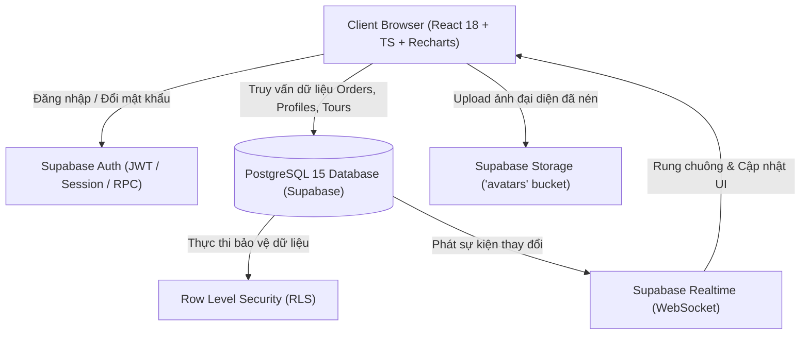

# TourFlow CRM — Hệ Thống Quản Lý & Điều Hành Đơn Tour Du Lịch

<p align="center">
  <strong>Giải pháp quản trị bán hàng, điều hành tour và đo lường hiệu suất nhân viên toàn diện dành cho doanh nghiệp du lịch nội bộ.</strong>
</p>

<p align="center">
  
  
  
  
  
  
  
</p>

---

## 📑 Mục lục

1. [Giới thiệu Tổng quan](#-giới-thiệu-tổng-quan)
2. [Kiến trúc & Công nghệ](#-kiến-trúc--công-nghệ)
3. [Phân quyền Người dùng (RBAC Matrix)](#-phân-quyền-người-dùng-rbac-matrix)
4. [Tính năng Nổi bật](#-tính-năng-nổi-bật)
   - [4.1. Dashboard Quản trị & Hiệu suất Saler (Recharts)](#41-dashboard-quản-trị--hiệu-suất-saler-recharts)
   - [4.2. Quản lý Đơn Tour Nâng cao & Xuất Excel](#42-quản-lý-đơn-tour-nâng-cao--xuất-excel)
   - [4.3. Quản lý Danh mục Tour & Dạng Phòng](#43-quản-lý-danh-mục-tour--dạng-phòng)
   - [4.4. Chuông Thông báo Realtime & Âm thanh Chime](#44-chuông-thông-báo-realtime--âm-thanh-chime)
   - [4.5. Quản lý Đội ngũ Nhân viên Sale](#45-quản-lý-đội-ngũ-nhân-viên-sale)
   - [4.6. Hồ sơ Cá nhân & Upload Avatar Tối ưu Canvas](#46-hồ-sơ-cá-nhân--upload-avatar-tối-ưu-canvas)
   - [4.7. Quản lý Mật khẩu Hai Luồng](#47-quản-lý-mật-khẩu-hai-luồng)
   - [4.8. Tối ưu Trải nghiệm Mobile & Đa Giao diện (Dark / Light)](#48-tối-ưu-trải-nghiệm-mobile--đa-giao-diện-dark--light)
   - [4.9. Quản trị Khách hàng & Nhận diện Khách quay lại (Customer ID & Return Visits)](#49-quản-trị-khách-hàng--nhận-diện-khách-quay-lại-customer-id--return-visits)
5. [Cơ sở Dữ liệu & Chính sách Bảo mật (RLS)](#-cơ-sở-dữ-liệu--chính-sách-bảo-mật-rls)
6. [Cấu trúc Thư mục Dự án](#-cấu-trúc-thư-mục-dự-án)
7. [Hướng dẫn Cài đặt & Khởi chạy](#-hướng-dẫn-cài-đặt--khởi-chạy)
8. [Tài liệu Đặc tả Kỹ thuật Chi tiết](#-tài-liệu-đặc-tả-kỹ-thuật-chi-tiết)

---

## 🌟 Giới thiệu Tổng quan

**TourFlow CRM** là hệ thống quản trị quan hệ khách hàng và điều hành tour du lịch chuyên nghiệp, hỗ trợ tối đa cho **Nhân viên Sale (Saler)** trong việc chăm sóc khách hàng và **Ban Quản trị (Admin)** trong việc giám sát hiệu suất kinh doanh thời gian thực.

Hệ thống giải quyết triệt để các vấn đề:
- **Tập trung hóa dữ liệu sản phẩm & tour:** Toàn bộ thông tin khách hàng, sản phẩm đã gửi (tour), khách sạn, loại phòng, quốc tịch, nguồn tiếp thị và tháng khởi hành mong muốn được quản lý tại một nơi.
- **Bảo mật dữ liệu tuyệt đối (PostgreSQL RLS):** Saler chỉ xem, sửa và xóa đơn do chính mình tạo ra. Admin nắm toàn quyền giám sát hệ thống.
- **Tra cứu và đối soát linh hoạt:** Bộ lọc kép theo Ngày đặt đơn (đối soát sale) và Tháng khởi hành (thang đo tháng `MM/YYYY`, hỗ trợ khách chọn nhiều tháng với phép toán logic OR).
- **Trực quan hóa chỉ số với Recharts:** Đo lường hiệu suất từng Saler, tỷ lệ chốt đơn, kế hoạch nhu cầu theo tháng khởi hành, phân bổ nguồn khách và thị trường quốc gia.
- **Giao diện đa nền tảng:** Tối ưu hóa hoàn hảo trên cả Desktop lẫn Mobile với hệ thống theme Sáng / Tối thông minh.

---

## 🛠 Kiến trúc & Công nghệ

### Tech Stack Chi tiết

| Tầng | Công nghệ | Phiên bản | Mục đích sử dụng |
| :--- | :--- | :--- | :--- |
| **Frontend Core** | **React 18** + **TypeScript** | `18.3.1` / `5.5.3` | Single Page Application phản hồi cao, an toàn kiểu dữ liệu |
| **Build Tool** | **Vite** | `5.4.2` | Máy chủ phát triển HMR siêu tốc và build bundle sản phẩm |
| **Routing** | **React Router DOM** | `7.18.3` | Điều hướng client-side, protected routes và phân quyền |
| **Charts** | **Recharts** | `3.10.1` | Biểu đồ cột (Bar), biểu đồ tròn (Pie), tooltip theo theme |
| **Icons & UI** | **Lucide React** | `0.446.0` | Hệ thống biểu tượng giao diện hiện đại |
| **Xử lý Excel** | **XLSX (SheetJS)** | `0.18.5` | Xuất file Excel (.xlsx) và CSV với đầy đủ cột dữ liệu |
| **Styling** | **Vanilla CSS + Tokens** | Chuẩn CSS3 | Hệ thống Design Tokens Dark/Light, không phụ thuộc UI framework nặng |
| **Utility CSS** | **Tailwind CSS** | `3.4.1` | Tiện ích bố cục nhanh và responsive |
| **Backend & BaaS** | **Supabase** | `2.57.4` | Authentication, PostgreSQL Database, Storage, Realtime Channels |
| **Cơ sở dữ liệu** | **PostgreSQL** | 15.x | RLS Policies, Functions, Triggers, Foreign Keys |
| **Âm thanh** | **Web Audio API** | Native | Tạo chuông thông báo 2 nốt trong trẻo (D5 -> A5) |
| **Xử lý ảnh** | **HTML5 Canvas** | Native | Cắt vuông chính giữa và nén avatar 512x512px trước khi upload |

### Sơ đồ Kiến trúc



---

## 👥 Phân quyền Người dùng (RBAC Matrix)

| Chức năng / Quyền hạn | Saler (`saler`) | Admin (`admin`) | Ghi chú bảo mật |
| :--- | :---: | :---: | :--- |
| **Đăng nhập hệ thống** | ✅ | ✅ | Hỗ trợ đăng nhập qua Username hoặc Email |
| **Đổi mật khẩu cá nhân** | ✅ | ✅ | Yêu cầu xác thực mật khẩu cũ |
| **Quên / Đặt lại mật khẩu** | ✅ | ✅ | Nhận liên kết khôi phục qua Email |
| **Xem Hồ sơ & Đổi Avatar** | ✅ | ✅ | Tự động cắt vuông và nén ảnh 512x512px |
| **Xem chuông thông báo Realtime** | ✅ | ✅ | Chỉ nhận thông báo liên quan đến đơn của mình |
| **Tạo mới đơn tour** | ✅ | ✅ *(qua URL)* | Tự động gán `owner_id` là user đang đăng nhập |
| **Xem danh sách đơn tour** | ✅ *(Đơn của mình)* | ✅ *(Toàn bộ đơn)* | Được bảo vệ bởi RLS ở cấp database |
| **Tìm kiếm & Lọc đơn nâng cao** | ✅ | ✅ | Lọc theo ngày đặt, tháng khởi hành (OR logic), trạng thái, Saler |
| **Chỉnh sửa đơn tour** | ✅ *(Đơn của mình)* | ✅ *(Toàn bộ đơn)* | Giữ nguyên `owner_id` gốc khi sửa |
| **Xóa đơn tour** | ✅ *(Đơn của mình)* | ✅ *(Toàn bộ đơn)* | Có hộp thoại xác nhận an toàn |
| **Xuất dữ liệu Excel / CSV** | ✅ *(Đơn của mình)* | ✅ *(Toàn bộ đơn)* | Xuất đủ 15 cột thông tin đơn tour |
| **Dashboard Tổng quan & Recharts** | ❌ | ✅ | Thống kê KPI, biểu đồ hiệu suất, kế hoạch tháng khởi hành |
| **Quản trị Nhân viên Sale** | ❌ | ✅ | Tạo mới, khóa/mở khóa (`is_active`), cấp lại mật khẩu |
| **Quản trị Sản phẩm (Tour) & Phòng**| ❌ | ✅ | Thêm, sửa inline, bật/tắt sản phẩm và loại phòng |
| **Xem Nhật ký Hệ thống (Activity)** | ❌ | ✅ | Giám sát toàn bộ thao tác theo thời gian thực (LIVE) |

---

## 🚀 Tính năng Nổi bật

### 4.1. Dashboard Quản trị & Hiệu suất Saler (Recharts)
Dành riêng cho Quản trị viên (`/dashboard`):
- **4 thẻ chỉ số KPI tổng hợp:** Tổng số đơn, Đơn đang tư vấn, Đã chốt thành công, Tỷ lệ chốt đơn trung bình (`(Đã chốt / Tổng đơn) * 100%`).
- **Thẻ Hiệu suất Saler (Recharts Bar Chart):**
  - Lọc theo từng nhân viên hoặc tất cả; Lọc theo khoảng thời gian (7 ngày, 30 ngày, 90 ngày, tất cả).
  - 4 cột trạng thái: Mới (`#38bdf8`), Đang tư vấn (`#f59e0b`), Đã chốt (`#10b981`), Đã hủy (`#f43f5e`). Bo góc `radius={[6, 6, 0, 0]}`.
- **Biểu đồ Nhu cầu theo Tháng khởi hành (Departure Month Bar Chart):**
  - Trực quan hóa toàn diện theo **Thang đo Tháng** (`MM/YYYY`, ví dụ: `09/2026`, `12/2026`, `02/2027`, `03/2027`...).
  - Cột xếp chồng (Stacked) theo 4 trạng thái: Mới, Đang tư vấn, Đã chốt, Đã hủy.
  - **Tương tác Drilldown thông minh:** Người dùng có thể click vào nút tháng (Month pills) hoặc click trực tiếp vào cột biểu đồ để mở bảng danh sách khách hàng mong muốn đi trong tháng đó (hiển thị rõ: Mã đơn, Tên khách hàng, SĐT, Sản phẩm đã gửi, Số khách, Trạng thái).
  - **Điều hướng 1-click:** Nút "Xem tại trang Đơn tour" tự động chuyển hướng và áp dụng bộ lọc tháng khởi hành tương ứng.
- **Biểu đồ Phân bổ Quốc gia (Country Distribution):** Thống kê thị trường khách hàng theo quốc tịch (Top 5, Top 10, Tất cả).
- **Biểu đồ Kênh Tiếp Thị (Marketing Sources):** Biểu đồ tròn PieChart phân bổ nguồn khách (Facebook, Instagram, WhatsApp, Email, Khách cũ, Khác) và bảng tỷ lệ chuyển đổi.

### 4.2. Quản lý Đơn Tour Nâng cao & Xuất Excel
- **Phân loại Tour (Tour grupal & Tour privado):**
  - **Tour grupal:** Tour ghép đoàn theo lịch trình tiêu chuẩn. Hiển thị compact badge `[Users Grupal]` (xanh dương). Ẩn các trường tour riêng và upload PDF.
  - **Tour privado:** Tour riêng theo yêu cầu cá nhân hóa của du khách. Hiển thị compact badge `[UserRound Privado]` (tím). Cho phép nhập **Tên tour riêng** (`private_tour_name`) và tải lên **Chương trình tour (PDF)** (`private_tour_pdf_path`).
  - **Quản lý vòng đời file PDF an toàn:**
    - Lưu trữ trong Supabase Storage bucket riêng tư (`private-tour-programs`, tối đa 20MB, chỉ file PDF).
    - Tạo **Signed URL** bảo mật có thời hạn (1 giờ) khi xem/tải chương trình trong chi tiết đơn (`OrderDetail`). Không lưu hay công khai URL tĩnh.
    - Quản lý linh hoạt trong form chỉnh sửa (`OrderForm`): Hỗ trợ `[Xem]`, `[Thay file]`, `[Xóa file]`.
    - Tự động xóa file cũ khi thay file mới, khi chuyển từ `Privado` sang `Grupal` hoặc khi xóa đơn tour, ngăn chặn tuyệt đối tình trạng file mồ côi (orphan files).
- **Quy chuẩn tên trường nghiệp vụ & Phân định Quốc tịch / Destino:**
  - Trường **"Tour"** đổi thành **"Sản phẩm đã gửi"** (áp dụng đồng bộ từ bảng đơn tour, bộ lọc tìm kiếm, form tạo/chỉnh sửa đến chi tiết đơn và file xuất Excel).
  - Trường **"Ngày đi tour"** đổi thành **"Tháng khởi hành"** (thang đo tháng dạng `MM/YYYY`, ví dụ: `02/2027`).
  - Trường **"Quốc gia"** đổi thành **"Quốc tịch"** (`customer_country`): Đại diện cho quốc tịch của khách hàng (ví dụ: 🇦🇷 Argentina, 🇻🇳 Vietnam, 🇪🇸 Spain). Trên bảng `/orders`, quốc tịch hiển thị theo định dạng cờ trực quan kèm tên quốc gia thu gọn và tooltip đầy đủ khi rê chuột.
  - **Trường mới "Destino" (`destinations text[]`):** Đại diện cho các điểm đến mà khách hàng quan tâm ghé thăm. Danh mục chuẩn hóa gồm 10 điểm đến: *Vietnam, Tailandia, Camboya, Bali, China, Japon, Corea, Laos, Singapore, Malaisia*.
    - Trên Form tạo/sửa: Sử dụng component `DestinationMultiSelect` cho phép chọn linh hoạt, hiển thị tag có nút xóa `×`, chống trùng lặp điểm đến.
    - Trên Chi tiết đơn (`OrderDetail`): Hiển thị danh sách badge điểm đến nổi bật hoặc hiển thị `Chưa có` nếu đơn cũ chưa chọn.
    - **Không hiển thị cột Destino trên Bảng tổng quan `/orders`** nhằm giữ bảng thông tin luôn gọn gàng, súc tích và dễ tra cứu.
- **Nghiệp vụ Đa Tháng khởi hành (Multi-Month Selection):**
  - Một khách hàng (pax) có thể mong muốn đi tour vào một hoặc nhiều tháng trong năm (ví dụ: `02/2027`, `03/2027`, `05/2027`).
  - Tích hợp component tương tác cao `MonthMultiSelector`: Cho phép đổi năm (`2026`, `2027`, `2028`), chọn nhanh theo Quý (Q1 - Q4), tick chọn từng tháng (1 - 12), chọn tháng tùy ý và quản lý tag các tháng đã chọn.
  - Trên Bảng Đơn Tour (Overview): Hiển thị huy hiệu gọn gàng `02/2027` hoặc `02/2027 +2` khi chọn nhiều tháng, hover chuột hiển thị tooltip danh sách đầy đủ các tháng.
  - Trên Chi tiết đơn (OrderDetail): Hiển thị huy hiệu hành trình tính số tháng dự kiến khởi hành từ tháng sớm nhất, tránh lỗi sai lệch ngày tháng.
- **Bộ lọc thời gian & Sắp xếp mặc định:**
  - **Sắp xếp mặc định:** Bảng danh sách đơn tour (`/orders` và `/admin/orders`) mặc định sắp xếp theo **Ngày tạo đơn** (`booking_date` / `created_at`) giảm dần (đơn mới nhất lên đầu). Người dùng có thể bấm vào tiêu đề cột `NGÀY TẠO ĐƠN` hoặc `THÁNG KHỞI HÀNH` để đảo chiều tăng/giảm linh hoạt.
  - Chuyển đổi linh hoạt giữa **Ngày tạo đơn (Booking Date)** hoặc **Tháng đi tour (Departure Month)** trong bộ lọc toolbar (mặc định hiển thị tab Ngày tạo đơn).
  - Bộ lọc Tháng đi tour hỗ trợ chọn nhanh các tháng có dữ liệu thực tế và lọc theo **toán tử logic OR** (ví dụ khách mong muốn đi vào tháng 02/2027 hoặc 08/2027, khi lọc tháng 08/2027 hệ thống sẽ lập tức tìm thấy đơn này).
- **Thông tin đơn đầy đủ:** Khách hàng (Họ tên, SĐT, Email, Quốc tịch), Điểm đến quan tâm (Destino), Sản phẩm đã gửi, Loại tour, Tên tour riêng, Dạng phòng (`room_type`), Số lượng khách (`num_guests`), Hạng sao khách sạn (`rating` 1 - 5 sao), Nguồn tiếp thị (`request_source`), Ghi chú.
- **Xuất Excel / CSV:** Nút xuất file tải về báo cáo gồm đầy đủ 18 trường dữ liệu chuẩn hóa (bao gồm Quốc tịch, Destino, Loại tour và Tên tour riêng).

### 4.3. Quản lý Danh mục Sản phẩm đã gửi (Tour) & Dạng Phòng
Truy cập tại `/admin/settings`:
- **Danh mục Sản phẩm đã gửi (Tours):** Quản lý danh mục sản phẩm, thêm sản phẩm mới, sửa tên trực tiếp trên bảng, bật/tắt trạng thái mở bán, xóa sản phẩm an toàn.
- **Danh mục Dạng phòng (Room Types):** Quản lý các loại phòng (Phòng đơn, Phòng đôi, Twin, Triple, Family Suite, Villa...), thêm mới và bật/tắt áp dụng.

### 4.4. Chuông Thông báo Realtime & Âm thanh Chime
- Tích hợp component `NotificationBell` góc trên Topbar.
- Lắng nghe sự kiện qua WebSocket (Supabase Realtime) trên bảng `activity_logs`.
- **Tổng hợp âm thanh Web Audio API:** Chuông 2 nốt D5 -> A5 phát khi có đơn mới hoặc cập nhật trạng thái. Có nút Bật/Tắt và Nghe thử âm thanh.
- **Bảo mật thông báo:** Saler chỉ nhận thông báo về đơn của mình, không nhận thông báo của Saler khác.

### 4.5. Quản lý Đội ngũ Nhân viên Sale
Truy cập tại `/admin/salers`:
- **Tạo nhân viên mới:** Tự động chuẩn hóa họ tên tiếng Việt và sinh username (ví dụ: `nguyen.van.an.7k2a`).
- **Khóa / Mở khóa tài khoản (`is_active`):** Khi tài khoản bị khóa, nhân viên lập tức bị chặn đọc ghi DB và bị đăng xuất.
- **Cấp lại mật khẩu trực tiếp:** Admin có thể đổi mật khẩu mới cho nhân viên ngay trên giao diện.

### 4.6. Hồ sơ Cá nhân & Upload Avatar Tối ưu Canvas
Truy cập tại `/profile`:
- Cập nhật họ tên hiển thị.
- Tải lên ảnh đại diện: HTML5 Canvas tự động cắt vuông chính giữa và nén về kích thước chuẩn 512x512px (dung lượng siêu nhẹ ~100-200KB).
- Tự động xóa các file ảnh cũ trên Supabase Storage bucket `avatars` khi thay ảnh mới.
- Tùy chỉnh bật/tắt chuông thông báo âm thanh.

### 4.7. Quản lý Mật khẩu Hai Luồng
- **Đổi mật khẩu trong hệ thống (`/settings/change-password`):** Xác thực mật khẩu cũ trước khi đổi mật khẩu mới (≥ 8 ký tự).
- **Quên mật khẩu qua email (`/forgot-password` → `/reset-password`):** Nhận liên kết khôi phục an toàn qua Supabase Auth.

### 4.8. Tối ưu Trải nghiệm Mobile & Đa Giao diện (Dark / Light)
- Chuyển đổi giao diện Sáng / Tối 1-click bằng nút ☀️/🌙 trên Topbar.
- Trên màn hình di động (< 768px): Bảng dữ liệu tự động chuyển thành **Thẻ đơn tour di động (Mobile Cards)** có nút bấm gọi điện thoại trực tiếp (`tel:`) và chạm vào thẻ để xem chi tiết.
- Sidebar chuyển đổi thành Drawer trượt với lớp phủ làm mờ nền.

### 4.9. Quản trị Khách hàng & Nhận diện Khách quay lại (Customer ID & Return Visits)
- **Mô hình Dữ liệu Nghiệp vụ Chuẩn:**
  `Customer` → `Return Visit / Interaction (Đợt tương tác)` → `Orders (Đơn tour)`.
  - Một khách hàng có thể có nhiều đơn tour trong cùng 1 đợt quay lại (`1 Visit = N Orders`).
  - Hệ thống **tuyệt đối không đánh đồng 1 đơn tour = 1 đợt quay lại**.
- **Định danh Khách hàng Tự động (Customer ID):**
  - Sinh mã khách hàng tự động và duy nhất dạng `CUS-XXXXXX` (tách biệt hoàn toàn với mã đơn `ORD-XXXXXX` và số lần quay lại).
  - Nhân viên Sale không cần ghi nhớ hay nhập thủ công Customer ID.
- **Luồng Khách hàng Mới (New Customer Flow):**
  - Tự động tạo hồ sơ trong bảng `customers`, sinh Customer ID và khởi tạo đợt tương tác đầu tiên (`visit_number = 1`).
  - **Cảnh báo trùng lặp thông minh (Duplicate Warning):** Khi Saler nhập SĐT hoặc Email trùng với khách hàng đã có trong hệ thống, giao diện hiển thị ngay banner cảnh báo với hai lựa chọn minh bạch: *"Dùng khách hàng cũ này"* hoặc *"Bỏ qua & Tiếp tục tạo mới"*.
- **Luồng Khách hàng Cũ (Existing Customer Flow):**
  - Tìm kiếm server-side tốc độ cao qua RPC `search_customers(p_query)`: Khớp theo tên (hỗ trợ tiếng Việt không dấu), số điện thoại, email (không phân biệt hoa thường), tự động loại bỏ khoảng trắng thừa.
  - Kết quả tìm kiếm hiển thị đầy đủ thông tin phân biệt: Tên, SĐT, Email, Quốc tịch, Tổng số đơn đã đặt, Tổng số lần quay lại.
- **Phát hiện Trùng lặp Thời gian Tour (Tour Date Overlap Detection):**
  - Tự động so sánh khoảng thời gian/tháng khởi hành của đơn mới với các đơn trước đó của khách hàng.
  - Khi phát hiện trùng lặp, hệ thống **không tự ý quyết định thay Saler** mà đưa ra hộp thoại xác nhận rõ ràng:
    - **Cùng đợt tương tác (Same Return Visit):** Gắn đơn mới vào đợt quay lại hiện tại, giữ nguyên số lần quay lại (`visit_number`).
    - **Đợt tương tác mới (New Return Visit):** Tạo đợt quay lại mới với số thứ tự tăng dần an toàn (`visit_number + 1`).
- **Phân tách Rõ ràng Trạng thái Đơn & Số lần Quay lại:**
  - Trạng thái đơn (`new`, `consulting`, `closed`, `cancelled`) phản ánh vòng đời xử lý đơn hàng.
  - Số lần quay lại (`visit_number`) phản ánh lịch sử tương tác của khách.
  - **Khi hủy đơn (`cancelled`):** Số lần quay lại của khách hàng **vẫn được bảo toàn**, không bị giảm đi.
- **Modal Lịch sử Khách hàng (`CustomerHistoryModal`):**
  - Mở nhanh 1-click từ badge mã khách hàng hoặc badge lần quay lại trên bảng đơn tour và trang chi tiết đơn.
  - Trực quan hóa toàn bộ hành trình: Thống kê tổng số lần tương tác, tổng số đơn, timeline nhóm các đơn tour theo từng đợt quay lại.
- **Bộ lọc Khách mới / Khách quay lại trên Danh sách Đơn:**
  - Bộ lọc tab: `Tất cả` | `Khách mới (Lần 1)` | `Khách quay lại (Lần ≥ 2)`.

---

## 🔒 Cơ sở Dữ liệu & Chính sách Bảo mật (RLS)

### 1. Bảng Dữ Liệu Thực Tế

| Bảng | Chức năng chính | Cột quan trọng |
| :--- | :--- | :--- |
| `profiles` | Hồ sơ người dùng, phân quyền | `id`, `username`, `display_name`, `email`, `role`, `is_active`, `avatar_url`, `created_at`, `updated_at` |
| `customers` | Hồ sơ khách hàng, mã Customer ID | `id`, `customer_code` *(CUS-XXXXXX)*, `full_name`, `phone`, `email`, `country`, `created_at`, `updated_at` |
| `customer_return_visits` | Đợt quay lại / tương tác của khách | `id`, `customer_id`, `visit_number` *(1, 2, 3...)*, `notes`, `created_at`, `updated_at` |
| `orders` | Đơn tour & sản phẩm du lịch | `id`, `order_code` *(ORD-XXXXXX)*, `owner_id`, `customer_id`, `return_visit_id`, `customer_name`, `customer_phone`, `customer_email`, `tour_name` *(Sản phẩm đã gửi)*, `tour_type`, `private_tour_name`, `private_tour_pdf_path`, `booking_date`, `tour_date` *(Tháng khởi hành, kiểu `text`, định dạng `MM/YYYY` hoặc đa tháng)*, `status`, `room_type`, `num_guests`, `rating`, `customer_country`, `destinations`, `request_source`, `request_source_other`, `notes`, `created_at`, `updated_at` |
| `tours` | Danh mục sản phẩm đã gửi (Tour) | `id`, `name`, `is_active`, `created_at`, `updated_at` |
| `room_types` | Danh mục loại phòng | `id`, `name`, `is_active`, `created_at`, `updated_at` |
| `activity_logs` | Nhật ký thao tác & realtime | `id`, `actor_id`, `target_user_id`, `action_type`, `description`, `ip_address`, `created_at` |

### 2. Trạng Thái Đơn Tour (`order_status`)
Hệ thống sử dụng enum `public.order_status` gồm 4 trạng thái:
- `'new'`: Mới tiếp nhận
- `'consulting'`: Đang tư vấn
- `'closed'`: Đã chốt thành công
- `'cancelled'`: Đã hủy đơn

> **Lưu ý nghiệp vụ:** Trạng thái đơn tour hoàn toàn tách biệt với số lần quay lại của khách hàng (`visit_number`). Khi đơn bị hủy (`cancelled`), lịch sử đợt quay lại của khách không bị trừ hay xóa bỏ.

### 3. Hàm Nghiệp Vụ & Khóa Dữ Liệu Đồng Thời (Concurrency Protection)
- **`create_customer_return_visit(p_customer_id, p_notes)`:** Tạo đợt quay lại an toàn với khóa dòng `PERFORM id FROM customers WHERE id = p_customer_id FOR UPDATE`. Ngăn chặn tuyệt đối việc hai Saler tạo đơn cùng lúc bị trùng số lần quay lại (`visit_number`).
- **`search_customers(p_query)`:** Tìm kiếm khách hàng đa năng theo tên (loại bỏ dấu tiếng Việt), số điện thoại, email (không phân biệt hoa thường) kèm theo số lượng đơn và số lần quay lại tổng hợp.
- **`get_customer_history(p_customer_id)`:** Lấy toàn bộ timeline lịch sử khách hàng dạng JSON lồng nhau, nhóm theo từng đợt quay lại.

### 4. Chính Sách Bảo Mật Cấp Hàng (RLS)
- **`customers` & `customer_return_visits`:** Nhân viên có tài khoản kích hoạt (`is_my_account_active() = true`) được phép tìm kiếm, đọc và tạo mới khách hàng/đợt tương tác; Admin có toàn quyền quản trị (`get_my_role() = 'admin'`).
- **`orders`:** Saler chỉ xem, tạo, sửa và xóa đơn có `owner_id = auth.uid()` và khi tài khoản đang hoạt động (`is_my_account_active() = true`). Admin có toàn quyền trên mọi đơn hàng.
- **`profiles`:** Mọi người dùng đã đăng nhập có thể đọc bảng `profiles` (hiển thị tên, avatar), chỉ sửa profile của chính mình.
- **`activity_logs`:** Cho phép đọc phục vụ Realtime replication.
- **Storage:** Bucket `avatars` công khai ảnh đại diện; Bucket `private-tour-programs` bảo mật nghiêm ngặt (`public = false`), chỉ truy cập qua Signed URL 1 giờ.

---

## 📂 Cấu trúc Thư mục Dự án

```
system-management/
├── SYSTEM_SPEC.md                 # Tài liệu đặc tả kỹ thuật chi tiết toàn diện (Single Source of Truth)
├── PRD.md                         # Product Requirements Document
├── README.md                      # Hướng dẫn và tổng quan dự án
├── UI requirement.md              # Đặc tả thiết kế giao diện UI/UX
└── frontend/                      # Ứng dụng Frontend React + Vite
    ├── index.html                 # Entry point HTML
    ├── package.json               # Dependencies & scripts
    ├── tsconfig.json              # Cấu hình TypeScript
    ├── vite.config.ts             # Cấu hình Vite bundler
    ├── eslint.config.js           # Cấu hình ESLint 9
    ├── vercel.json                # Cấu hình rewrite routing cho Vercel SPA
    ├── scripts/                   # Scripts quản lý, kiểm thử và migration DB qua Node.js
    │   ├── apply-migration.js     # Script thực thi migration SQL trực tiếp
    │   ├── run-migration.js       # Chạy migration database chính
    │   ├── run-status-migration.js# Migration cập nhật enum order_status mới
    │   ├── test-all-cases.js      # Bộ kiểm thử 14 ca nghiệp vụ Customer ID & Return Visits
    │   ├── test-concurrency.js    # Kiểm thử đồng thời (Concurrency) chống trùng số lần quay lại
    │   ├── verify-migration.js    # Kiểm tra di trú dữ liệu độc lập và liên kết Customer ID
    │   ├── add-delete-policy.js   # Bổ sung policy xóa đơn cho Saler
    │   ├── add-rpc.js             # Tạo hàm RPC get_email_by_username
    │   ├── check-db.js            # Kiểm tra cấu trúc database thực tế
    │   ├── fix-trigger.js         # Cập nhật triggers cho status enum mới
    │   ├── update-activity-rls.js # Cập nhật RLS cho activity_logs realtime
    │   └── update-rls-active.js   # Cập nhật RLS kiểm tra is_active
    ├── supabase/                  # Các tập tin migration SQL
    │   └── migrations/
    │       ├── 20260909100000_tourflow_schema.sql
    │       ├── 20260915110000_realtime_notifications.sql
    │       ├── 20260915130000_profile_avatar.sql
    │       ├── 20260915140000_allow_read_profiles.sql
    │       ├── 20260915150000_tours_and_room_types.sql
    │       ├── 20260915160000_add_guests_and_rating.sql
    │       ├── 20260915160000_update_activity_logs_realtime_rls.sql
    │       ├── 20260915170000_update_order_statuses.sql
    │       ├── 20260915180000_fix_order_trigger_status_enum.sql
    │       ├── 20260917000000_add_country_and_source.sql
    │       ├── 20260926180000_alter_tour_date_to_text.sql # Nâng cấp tour_date sang text (MM/YYYY)
    │       ├── 20260926200000_add_tour_type_and_private_tour_pdf.sql # Thêm tour_type, tên riêng, PDF storage
    │       ├── 20260927010000_customer_and_return_visits.sql # Quản lý Customer ID & Return Visits
    │       └── reset_admin.sql
    └── src/
        ├── App.tsx                # Toàn bộ logic Routes, Views, Dashboard & Order CRUD
        ├── index.css              # Hệ thống Design Tokens, Dark/Light theme & CSS
        ├── main.tsx               # Khởi tạo React DOM Root
        ├── types.ts               # Khai báo TypeScript types (Customer, ReturnVisit, Order...)
        ├── lib/
        │   ├── supabase.ts        # Kết nối Supabase Client & Admin Client
        │   ├── countries.ts       # Danh mục cờ và mã quốc gia ISO
        │   └── sound.ts           # Xử lý âm thanh Web Audio API Chime
        ├── services/
        │   └── customerService.ts # Service xử lý nghiệp vụ tìm kiếm, lịch sử và overlap detection
        └── components/
            ├── AdminSettingsPage.tsx  # Màn hình quản trị Tours & Loại phòng
            ├── Avatar.tsx             # Component ảnh đại diện & fallback
            ├── CustomerHistoryModal.tsx # Modal xem lịch sử khách & các đợt quay lại
            ├── CustomerSelectionSection.tsx # Form chọn Khách mới / Khách cũ & Overlap check
            ├── DestinationMultiSelect.tsx   # Bộ chọn đa điểm đến quan tâm (Destino)
            ├── MonthMultiSelector.tsx # Bộ chọn đa tháng khởi hành (MM/YYYY, OR logic)
            ├── NotificationBell.tsx   # Chuông thông báo Realtime WebSocket
            ├── ProfilePage.tsx        # Trang hồ sơ cá nhân & upload avatar
            └── StarRating.tsx         # Đánh giá số sao khách sạn (1 - 5 sao)
```

---

## 💻 Hướng dẫn Cài đặt & Khởi chạy

### 1. Yêu cầu Tiên quyết
- **Node.js**: Phiên bản 18.0.0 trở lên.
- **npm** (đi kèm Node.js).
- Một dự án Supabase hoạt động.

### 2. Cài đặt Mã nguồn
```bash
# 1. Di chuyển vào thư mục frontend
cd frontend

# 2. Cài đặt các thư viện phụ thuộc
npm install
```

### 3. Cấu hình Biến Môi trường
Tập tin `.env` tại thư mục `frontend/`:

```env
# URL và Public Anon Key của Supabase
VITE_SUPABASE_URL=https://your-project.supabase.co
VITE_SUPABASE_ANON_KEY=your-anon-key-here

# Service Role Key (dành cho thao tác quản trị user nội bộ của Admin)
VITE_SUPABASE_SERVICE_ROLE_KEY=your-service-role-key-here

# Chuỗi kết nối PostgreSQL trực tiếp (dùng khi chạy migrations qua Node script)
DATABASE_URL=postgresql://postgres:[PASSWORD]@[HOST]:6543/postgres
```

### 4. Chạy Migration Cơ sở Dữ liệu
```bash
# Khởi tạo schema chính
npm run db:migrate

# Reset hoặc đảm bảo tài khoản admin mặc định
npm run db:reset
```

### 5. Khởi chạy Ứng dụng
```bash
# Chạy máy chủ phát triển
npm run dev

# Kiểm tra an toàn kiểu dữ liệu TypeScript
npm run typecheck

# Kiểm tra quy chuẩn mã nguồn ESLint
npm run lint

# Đóng gói sản phẩm
npm run build
```

Ứng dụng khởi chạy tại địa chỉ: **`http://localhost:5173`**

### 6. Bộ Kiểm Thử Nghiệp Vụ (Automated Test Suites)
Dự án tích hợp sẵn bộ kiểm thử đầu-cuối (End-to-End Test Suite) kiểm tra toàn vẹn dữ liệu, bao phủ 14 ca kiểm thử nghiệp vụ đặc thù và kiểm thử đồng thời (Concurrency):

```bash
# Kiểm tra di trú dữ liệu cũ và liên kết Customer ID
node scripts/verify-migration.js

# Kiểm thử 14 ca nghiệp vụ (Khách mới, tìm kiếm, overlap tour date, cùng/khác visit, hủy đơn...)
node scripts/test-all-cases.js

# Kiểm thử đồng thời (Concurrency) với 2 Saler tạo đơn song song chống trùng visit_number
node scripts/test-concurrency.js
```

### 7. Tài khoản Trải nghiệm
- **Tài khoản Quản trị viên (Admin):**
  - Email / Username: `th0935057511@gmail.com` hoặc `admin2026`
  - Mật khẩu: `1`
- **Tài khoản Nhân viên Sale (Saler):**
  - Có thể tạo thêm nhanh chóng từ trang Quản lý Nhân viên của Admin (`/admin/salers`).

---

## 📖 Tài liệu Đặc tả Kỹ thuật Chi tiết

Để nắm bắt toàn diện 20 mục đặc tả hệ thống từ tầng Database đến Frontend logic, vui lòng tham khảo:
👉 **[SYSTEM_SPEC.md](./SYSTEM_SPEC.md)** (Single Source of Truth của hệ thống).

---

<p align="center">
  <sub>TourFlow CRM © 2026 · Phát triển cho giải pháp quản trị du lịch nội bộ chuyên nghiệp.</sub>
</p>
