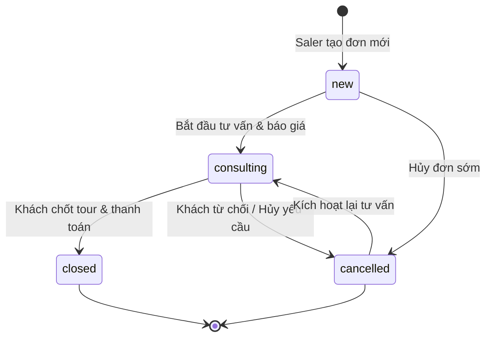

# System Specification — TourFlow CRM

> **Tài liệu Đặc Tả Kỹ Thuật & Nghiệp Vụ Toàn Diện (Single Source of Truth)**  
> **Dự án:** TourFlow CRM — Website Quản Lý Đơn Tour Du Lịch  
> **Trạng thái thực tế:** Production-Ready & Synchronized  
> **Ngày cập nhật:** 26/09/2026  
> **Phiên bản:** 2.5.0  

---

## 1. System Overview

**TourFlow CRM** là giải pháp phần mềm quản trị quan hệ khách hàng và điều hành kinh doanh tour du lịch nội bộ, phục vụ trực tiếp hai đối tượng: **Nhân viên Sale (Saler)** và **Ban Quản trị (Admin)**.

### Mục tiêu cốt lõi
1. **Tập trung hóa dữ liệu đơn tour:** Toàn bộ thông tin khách hàng, lịch trình, phòng nghỉ, nguồn tiếp thị và trạng thái đơn được quản lý tập trung trên một ứng dụng duy nhất, chấm dứt tình trạng phân tán qua Zalo, Messenger, WhatsApp hay file Excel thủ công.
2. **Cách ly dữ liệu khách hàng tuyệt đối:** Đảm bảo Saler chỉ xem, tạo, sửa và xóa đơn do chính mình phụ trách. Việc bảo mật được thực thi kép: tại giao diện Frontend và tại tầng cơ sở dữ liệu (**PostgreSQL Row-Level Security - RLS**).
3. **Tra cứu & Đối soát đa chiều:** Hỗ trợ lọc theo hai trục thời gian nghiệp vụ: **Ngày tạo đơn (Booking Date)** (dành cho đối soát hoa hồng và chỉ số sale) và **Ngày khởi hành (Tour Date)** (dành cho bộ phận điều hành tour và đặt dịch vụ).
4. **Trực quan hóa chỉ số kinh doanh:** Dashboard thời gian thực với biểu đồ Recharts đo lường hiệu suất từng Saler, phân bổ quốc gia khách hàng, kênh tiếp thị và tỷ lệ chuyển đổi chốt đơn (Conversion Rate).
5. **Thông báo và tương tác tức thời (Realtime):** Kết nối WebSocket cập nhật đơn mới, trạng thái và phát chuông âm thanh 2 nốt qua Web Audio API.

---

## 2. Architecture

Hệ thống được xây dựng theo kiến trúc **Single Page Application (SPA) kết hợp Backend-as-a-Service (BaaS)**:

```
┌────────────────────────────────────────────────────────────────────────────────────────┐
│                                CLIENT TẦNG FRONTEND                                    │
│  React 18 (SPA) · TypeScript · Vite · React Router v7 · Recharts · Lucide Icons        │
│  Design Tokens (CSS Variables: Dark/Light Mode) · Web Audio API · HTML5 Canvas         │
└────────────────────────────────────────┬───────────────────────────────────────────────┘
                                         │
                 ┌───────────────────────┴───────────────────────┐
                 │ HTTPS (REST / Auth API)                       │ WSS (Postgres Realtime)
                 ▼                                               ▼
┌────────────────────────────────────────────────────────────────────────────────────────┐
│                                SUPABASE PLATFORM (BaaS)                                │
│                                                                                        │
│  ┌───────────────────────┐   ┌───────────────────────────┐   ┌──────────────────────┐  │
│  │     Supabase Auth     │   │     Supabase Storage      │   │  Supabase Realtime   │  │
│  │ (JWT Session / Admin) │   │ (Bucket 'avatars' - 5MB)  │   │   (Replication Pub)  │  │
│  └───────────┬───────────┘   └─────────────┬─────────────┘   └──────────┬───────────┘  │
│              │                             │                            │              │
│  ┌───────────▼─────────────────────────────▼────────────────────────────▼───────────┐  │
│  │                         POSTGRESQL 15 DATABASE ENGINE                            │  │
│  │  - Row-Level Security (RLS) với helper get_my_role() & is_my_account_active()   │  │
│  │  - Triggers: Auto Profile, Updated_at, Order Code (ORD-XXXXXX), Activity Logs    │  │
│  │  - Functions: get_email_by_username (RPC)                                        │  │
│  │  - Tables: profiles, orders, tours, room_types, activity_logs                    │  │
│  └──────────────────────────────────────────────────────────────────────────────────┘  │
└────────────────────────────────────────────────────────────────────────────────────────┘
```

### Luồng Dữ Liệu (Data Flow)
1. **Thao tác người dùng trên UI** kích hoạt hàm xử lý trong `App.tsx` hoặc các components con (`AdminSettingsPage`, `ProfilePage`, `NotificationBell`).
2. **Supabase Client (`supabase`)** gửi request có kèm token xác thực JWT (Bearer Token) tới Supabase API.
3. **PostgreSQL** đánh giá các chính sách RLS (`pg_policies`). Nếu thỏa mãn quyền (`auth.uid() = owner_id` hoặc role `admin`), dữ liệu mới được đọc hoặc ghi.
4. **Triggers trong Database** tự động thực thi các nghiệp vụ nền: sinh mã đơn ngẫu nhiên `ORD-XXXXXX`, cập nhật cột `updated_at`, ghi nhật ký hoạt động vào bảng `activity_logs`.
5. **Supabase Realtime Publication** phát tán sự kiện thay đổi (`INSERT`, `UPDATE`, `DELETE`) qua kết nối WebSocket tới các client đang lắng nghe, kích hoạt re-render UI và rung chuông thông báo.

---

## 3. Tech Stack

| Thành phần | Công nghệ / Thư viện | Phiên bản | Vai trò & Mục đích sử dụng |
| :--- | :--- | :--- | :--- |
| **Ngôn ngữ** | TypeScript | `^5.5.3` | Kiểm soát chặt chẽ kiểu dữ liệu cho toàn bộ ứng dụng |
| **Thư viện UI** | React | `^18.3.1` | Xây dựng giao diện hướng component, hooks, context |
| **DOM Renderer** | React DOM | `^18.3.1` | Render cây DOM trên trình duyệt |
| **Công cụ đóng gói** | Vite | `^5.4.2` | Máy chủ phát triển HMR siêu tốc và build bundle sản phẩm |
| **Điều hướng** | React Router DOM | `^7.18.3` | Quản trị định tuyến client-side, protected routes, URL parameters |
| **Biểu đồ & Dashboard**| Recharts | `^3.10.1` | Vẽ biểu đồ cột, biểu đồ tròn, tooltip và legend tương tác |
| **Biểu tượng** | Lucide React | `^0.446.0` | Bộ icon SVG hiện đại, đồng bộ phong cách Linear / Vercel |
| **Xử lý Excel** | XLSX (SheetJS) | `^0.18.5` | Xuất dữ liệu đơn tour ra file `.xlsx` và `.csv` trực tiếp trên client |
| **Styling** | Vanilla CSS + Tokens | Chuẩn CSS3 | Hệ thống Design Tokens Dark/Light theme, responsive flex/grid |
| **Utility CSS** | Tailwind CSS + PostCSS | `^3.4.1` / `^8.4.35` | Các utility class hỗ trợ layout và bo góc |
| **BaaS Client** | `@supabase/supabase-js` | `^2.57.4` | Tương tác xác thực, database CRUD, storage upload, realtime |
| **Cơ sở dữ liệu** | PostgreSQL (Supabase) | 15.x | Lưu trữ quan hệ, trigger, procedure, RLS, replication |
| **Xử lý Âm thanh** | Web Audio API | Trình duyệt | Tổng hợp âm chuông 2 nốt tần số D5 (587.33Hz) -> A5 (880Hz) |
| **Xử lý Hình ảnh** | HTML5 Canvas API | Trình duyệt | Cắt vuông chính giữa và nén ảnh đại diện JPG chất lượng 0.86 (512x512px) |

---

## 4. User Roles & Permission Matrix

Hệ thống định nghĩa 2 vai trò người dùng trong enum `public.app_role`:

1. **`admin` (Quản trị viên):**
   - Nắm toàn quyền quản trị và giám sát hoạt động kinh doanh toàn hệ thống.
   - Xem toàn bộ đơn tour của tất cả nhân viên.
   - Thêm, sửa, xóa đơn tour của bất kỳ nhân viên nào.
   - Quản lý danh sách nhân viên Sale: tạo tài khoản mới, sửa thông tin, đổi vai trò, đổi mật khẩu trực tiếp, khóa/mở khóa (`is_active`), xóa tài khoản.
   - Xem bảng điều khiển số liệu kinh doanh (KPIs, Recharts biểu đồ hiệu suất, biểu đồ phân bổ quốc gia, kênh marketing).
   - Quản lý danh mục Tour du lịch và danh mục Loại phòng (`/admin/settings`).
   - Giám sát toàn bộ nhật ký thao tác thời gian thực (`/admin/activity`).

2. **`saler` (Nhân viên Sale):**
   - Chỉ xem và quản lý danh sách đơn tour do chính mình tạo ra (`owner_id = auth.uid()`).
   - Tạo mới đơn tour du lịch (`/orders/new`). Khi tạo mới, hệ thống tự động gán `owner_id = auth.uid()`.
   - Chỉnh sửa thông tin đơn tour của mình (`/orders/:id/edit`).
   - Xóa đơn tour của mình (`DELETE` policy kiểm tra quyền sở hữu).
   - Nhận thông báo Realtime khi có cập nhật trên đơn tour của mình hoặc thao tác do Admin thực hiện trên đơn của mình.
   - Cập nhật thông tin hồ sơ cá nhân và đổi ảnh đại diện cá nhân (`/profile`).
   - Đổi mật khẩu cá nhân (`/settings/change-password`).
   - **Tuyệt đối không xem được:** Đơn của Saler khác, Dashboard thống kê, Danh sách nhân viên, Cài đặt danh mục, Nhật ký toàn hệ thống.

### Ma trận Quyền Hạn Thực Tế (RBAC Matrix)

| Quyền hạn / Thao tác | Saler (`saler`) | Admin (`admin`) | Cơ chế bảo vệ |
| :--- | :---: | :---: | :--- |
| Đăng nhập (Username / Email) | ✅ | ✅ | Supabase Auth + RPC `get_email_by_username` |
| Quên mật khẩu qua email | ✅ | ✅ | `supabase.auth.resetPasswordForEmail` |
| Đổi mật khẩu cá nhân | ✅ | ✅ | Xác thực mật khẩu cũ qua `signInWithPassword` |
| Đổi avatar & thông tin cá nhân | ✅ | ✅ | Bảng `profiles` + Storage `avatars` |
| Xem đơn của chính mình | ✅ | ✅ | RLS: `auth.uid() = owner_id` |
| Xem đơn của Saler khác | ❌ | ✅ | RLS: `get_my_role() = 'admin'` |
| Tạo đơn tour mới | ✅ | ✅ *(qua URL)* | RLS: `auth.uid() = owner_id` |
| Chỉnh sửa đơn của mình | ✅ | ✅ | RLS: `auth.uid() = owner_id` |
| Chỉnh sửa đơn của người khác | ❌ | ✅ | RLS: `get_my_role() = 'admin'` |
| Xóa đơn của mình | ✅ | ✅ | RLS: `auth.uid() = owner_id AND is_my_account_active()` |
| Xóa đơn của người khác | ❌ | ✅ | RLS: `get_my_role() = 'admin'` |
| Xuất danh sách ra Excel / CSV | ✅ *(đơn của mình)*| ✅ *(toàn bộ)*| Thư viện `xlsx` client-side |
| Truy cập Dashboard & Thống kê | ❌ | ✅ | React Router Guard (`RoleRedirect`) |
| Quản lý tài khoản Sale | ❌ | ✅ | Route Guard + `supabaseAdmin` client |
| Quản lý Danh mục Tours & Phòng | ❌ | ✅ | Route Guard + RLS bảng `tours`, `room_types` |
| Xem toàn bộ Activity Logs | ❌ | ✅ | Route Guard + RLS bảng `activity_logs` |

---

## 5. Authentication Flow

Hệ thống sử dụng cơ chế xác thực JWT kết hợp Cookie/LocalStorage của **Supabase Auth**:

### 1. Đăng nhập linh hoạt (Dual Identifier Login)
- Người dùng có thể nhập **Email** hoặc **Username**.
- Nếu chuỗi nhập vào không chứa ký tự `@`:
  - Frontend gọi hàm RPC bảo mật: `supabase.rpc('get_email_by_username', { p_username: loginEmail })`.
  - Hàm RPC chạy với quyền `SECURITY DEFINER`, tra cứu bảng `profiles` và trả về email tương ứng.
  - Sau đó gọi `supabase.auth.signInWithPassword({ email: lookedUpEmail, password })`.
- Nếu đăng nhập thành công, hệ thống kiểm tra ngay cột `is_active` trên bảng `profiles`:
  - Nếu `is_active === false`: Ngay lập tức gọi `supabase.auth.signOut()`, hủy phiên làm việc và hiển thị lỗi: *"Tài khoản của bạn đã bị khóa. Vui lòng liên hệ quản trị viên."*

### 2. Quên mật khẩu & Đặt lại mật khẩu
- Trang `/forgot-password`: Nhập email để nhận liên kết khôi phục.
- Supabase gửi email chứa token khôi phục trỏ về URL: `{origin}/reset-password`.
- Trang `/reset-password`: Component `AuthRecoveryHandler` và `ResetPassword` bắt token từ URL hash hoặc sự kiện `PASSWORD_RECOVERY` của Supabase Auth:
  - Cho phép người dùng nhập mật khẩu mới (tối thiểu 8 ký tự).
  - Cung cấp nút tiện ích: *"Không đổi mật khẩu, vào hệ thống ngay"* nếu phiên đăng nhập đã được thiết lập.

### 3. Đổi mật khẩu trong hệ thống (`/settings/change-password`)
- Yêu cầu nhập 3 trường: Mật khẩu hiện tại, Mật khẩu mới (≥ 8 ký tự), Xác nhận mật khẩu mới.
- Hệ thống gọi lại `supabase.auth.signInWithPassword` với mật khẩu hiện tại để xác minh danh tính trước khi cho phép gọi `supabase.auth.updateUser({ password: next })`.

### 4. Kiểm soát phiên đăng nhập & Tài khoản bị khóa (Lockout Guard)
- Trong `ProtectedRoute` (bọc toàn bộ ứng dụng nội bộ):
  - Lắng nghe `supabase.auth.onAuthStateChange`.
  - Kiểm tra trạng thái `is_active` từ `profiles`. Nếu tài khoản bị Admin tắt hoạt động (`is_active: false`), người dùng bị logout cưỡng bức và điều hướng tới `/login?locked=true`.
  - Có cơ chế timeout an toàn 1.5 giây để chống kẹt màn hình loading.

---

## 6. Authorization & Role Routing

### Điều hướng theo vai trò (Role-Based Routing)
- Khi truy cập route gốc `/`: Component `RoleRedirect` kiểm tra vai trò của người dùng trong bảng `profiles`:
  - Nếu `role === 'admin'`: Điều hướng tới `/dashboard`.
  - Nếu `role === 'saler'`: Điều hướng tới `/orders`.
- Route `/admin/*` (`/admin/orders`, `/admin/salers`, `/admin/activity`, `/admin/settings`):
  - Được bảo vệ bởi component `AdminSettingsRoute` và kiểm tra logic trong view: Nếu `profile.role !== 'admin'`, tự động điều hướng về `/orders`.

---

## 7. Feature Specifications

### 7.1. Dashboard Quản trị & Hiệu suất Saler (Admin Only)
- **4 Thẻ KPI Tổng Hợp:**
  - Tổng số đơn tour toàn hệ thống.
  - Số đơn đang xử lý (Mới + Đang tư vấn).
  - Số đơn đã chốt thành công.
  - Tỷ lệ chốt đơn trung bình (`(Đã chốt / Tổng đơn) * 100%`).
- **Thẻ Hiệu suất Saler với Recharts Bar Chart:**
  - Lọc đa chiều: Theo từng Saler hoặc tất cả; Theo khoảng thời gian (7 ngày, 30 ngày, 90 ngày, tất cả).
  - Lọc theo Quốc gia khách hàng và Nguồn tiếp thị.
  - Biểu đồ 4 cột: Mới (`#38bdf8`), Đang tư vấn (`#f59e0b`), Đã chốt (`#10b981`), Đã hủy (`#f43f5e`). Bo góc nhẹ `radius={[6, 6, 0, 0]}`.
  - Tooltip tùy biến Dark/Light mode hiển thị số đơn và tỷ lệ phần trăm.
- **Biểu đồ Phân bổ Quốc gia (Country Distribution):**
  - Biểu đồ cột ngang/dọc hiển thị số lượng khách theo quốc tịch (lấy từ trường `customer_country`).
  - Lựa chọn xem Top 5, Top 10 hoặc Tất cả các quốc gia.
- **Biểu đồ Kênh Tiếp Thị (Marketing Request Sources):**
  - Recharts `PieChart` phân bổ nguồn khách: Facebook, Instagram, WhatsApp, Email, Khách cũ, Khác.
  - Bảng tỷ lệ chuyển đổi chốt đơn (Conversion Rate) theo từng nguồn tiếp thị.
- **Danh sách Đơn Tour Mới Tiếp Nhận:**
  - Hiển thị danh sách các đơn vừa được tạo gần nhất kèm trạng thái và liên kết nhanh.

### 7.2. Quản lý Đơn Tour (Orders Management)
- **Danh sách Đơn Tour:**
  - Sắp xếp mặc định: Theo **Ngày tạo đơn** (`booking_date`) giảm dần (đơn mới nhất lên đầu), tie-breaker bằng `created_at`. Cho phép bấm vào tiêu đề cột `NGÀY TẠO ĐƠN` hoặc `THÁNG KHỞI HÀNH` để đảo chiều tăng/giảm hoặc chuyển tiêu chí sắp xếp.
  - Phân trang: 10 đơn / trang (`PAGE_SIZE = 10`).
  - Cột **QUỐC TỊCH**: Đặt liền kề ngay giữa cột Khách hàng và Số điện thoại, hiển thị quốc tịch của khách hàng (`customer_country`) dưới dạng icon lá cờ đồ họa sắc nét bo góc nhẹ, rê chuột hiển thị tooltip tên quốc gia đầy đủ.
  - Cột **LOẠI TOUR**: Hiển thị compact badge `[Users Grupal]` (xanh dương) hoặc `[UserRound Privado]` (tím). Không dùng icon máy bay và không dùng emoji trực tiếp.
  - **Không hiển thị cột Destino trên bảng tổng quan** nhằm giữ độ đậm đặc thông tin và sự tinh gọn của bảng.
- **Bộ lọc Tìm kiếm Nâng cao:**
  - Tìm kiếm đồng thời theo: Tên khách hàng, Số điện thoại, Email, Sản phẩm đã gửi (Tên tour), Tên tour riêng (`private_tour_name`), Nhân viên phụ trách (Admin view).
  - Nút bấm *"Tìm kiếm"* kèm số lượng điều kiện đang kích hoạt và nút xóa nhanh tất cả tìm kiếm.
- **Bộ lọc Trạng thái:** Tất cả, Mới, Đang tư vấn, Đã chốt, Đã hủy.
- **Bộ lọc Thời gian Kép (Date Range Filter):**
  - Chuyển đổi giữa 2 trục: `booking_date` (Ngày tạo đơn) và `tour_date` (Tháng khởi hành / Tháng đi tour).
  - Đối với Tháng đi tour: Hỗ trợ lọc theo toán tử logic OR (nếu khách chọn nhiều tháng mong muốn, hệ thống sẽ khớp bất kỳ tháng nào người dùng lọc). Chọn nhanh các tháng có dữ liệu thực tế, tháng này, tháng sau, 3 tháng tới, năm nay, năm sau hoặc tháng cụ thể (`MM/YYYY`).
- **Xuất dữ liệu Excel / CSV:**
  - Nút xuất file trên toolbar (`XLSX.writeFile`).
  - Xuất đầy đủ 18 cột: Mã đơn, Ngày tạo đơn, Người tạo, Khách hàng, Số điện thoại, Email, Quốc tịch, Destino, Nguồn khách, Sản phẩm đã gửi, Loại tour, Tên tour riêng, Loại phòng, Số khách, Tháng khởi hành, Trạng thái, Đánh giá (Sao), Ghi chú.

### 7.3. Tạo & Chỉnh sửa Đơn Tour (Order Form)
- **Các trường thông tin khách hàng:**
  - Họ và tên khách hàng (bắt buộc).
  - Số điện thoại khách hàng (bắt buộc).
  - Email khách hàng (tùy chọn).
  - Quốc tịch khách hàng (`customer_country` - component `CountrySelect` với cờ quốc gia và tên quốc gia, phân biệt với điểm đến).
- **Các trường thông tin hành trình & dịch vụ:**
  - **Loại tour (`tour_type` - bắt buộc):**
    - `Tour grupal` (mặc định): Tour ghép đoàn tiêu chuẩn, tự động ẩn trường tên riêng và upload PDF.
    - `Tour privado`: Tour riêng tùy chỉnh, kích hoạt hai trường:
      1. **Tên tour riêng (`private_tour_name`):** Nhập tên tour cá nhân hóa của du khách (ví dụ: *Vietnam - Tailandia 18 días*).
      2. **Chương trình tour PDF (`private_tour_pdf_path`):** Tải lên file PDF lịch trình. Chỉ chấp nhận MIME `application/pdf`, extension `.pdf`, tối đa 20MB. Lưu trữ trong private bucket `private-tour-programs`.
  - **Destino (`destinations` - text[], tùy chọn):** Các điểm đến khách hàng quan tâm ghé thăm. Tích hợp component `DestinationMultiSelect` cho phép chọn nhiều điểm đến từ danh mục chuẩn (*Vietnam, Tailandia, Camboya, Bali, China, Japon, Corea, Laos, Singapore, Malaisia*), hiển thị dạng tag có nút xóa nhanh `×`.
  - Sản phẩm đã gửi (Tên tour - chọn từ danh mục `tours` đang hoạt động; nếu đang sửa đơn cũ có tour đã tắt, hệ thống vẫn giữ nguyên tour cũ trong danh sách chọn).
  - Dạng phòng (`room_type` - chọn từ danh mục `room_types` đang hoạt động).
  - Số lượng khách (`num_guests` - chỉ nhập số nguyên dương, mặc định 1).
  - Hạng sao khách sạn (`rating` - từ 1 đến 5 sao qua component `StarRating`, mặc định 5 sao).
  - Ngày tạo đơn (`booking_date` - mặc định ngày hiện tại).
  - Tháng khởi hành (`tour_date` - bắt buộc, dạng `text` định dạng `MM/YYYY`, tích hợp component `MonthMultiSelector` cho phép chọn một hoặc nhiều tháng mong muốn trong năm).
  - Trạng thái đơn (`status` - Mới, Đang tư vấn, Đã chốt, Đã hủy).
  - Nguồn request (`request_source` - Facebook, Instagram, WhatsApp, Email, Khách cũ, Khác).
  - Nguồn cụ thể (`request_source_other` - bắt buộc nhập khi nguồn là "Khác").
  - Ghi chú (`notes` - văn bản tự do).
- **Quy tắc bảo toàn người phụ trách & vòng đời PDF:**
  - Khi tạo mới: Gán `owner_id = user.id`. Nếu upload PDF, lưu file vào path `private-tour-programs/{order_id}/{timestamp}-{clean_filename}.pdf`. Nếu insert thất bại, dọn dẹp file đã upload để tránh rác storage.
  - Khi chỉnh sửa đơn: Giữ nguyên `owner_id` ban đầu. Cho phép xem file PDF cũ qua Signed URL, thay file mới (tự động xóa file cũ) hoặc xóa file. Khi chuyển từ `Privado` sang `Grupal`, tự động dọn dẹp file PDF cũ.

### 7.4. Chi tiết Đơn Tour (Order Detail)
- **Thông tin khách hàng (Customer Card):**
  - Họ và tên, SĐT, Email.
  - **Quốc tịch:** Hiển thị cờ + tên quốc gia (ví dụ: `🇦🇷 Argentina`).
  - **Destino:** Hiển thị danh mục các điểm đến đã chọn dưới dạng badge (ví dụ: `[ Vietnam ] [ Camboya ]`), hoặc `Chưa có` nếu đơn chưa chọn điểm đến.
- **Thanh tiến trình trạng thái (Pipeline):**
  - Trực quan hóa 3 bước: `Mới` (Bước 1) → `Đang tư vấn` (Bước 2) → `Đã chốt` (Bước 3).
  - Nếu đơn ở trạng thái `Đã hủy`, hiển thị banner thông báo riêng kèm nút kích hoạt lại về `Đang tư vấn`.
  - Hỗ trợ đổi trạng thái nhanh 1-click trực tiếp trên dropdown trạng thái đỉnh trang.
- **Thẻ đo lường nhanh (Metric Cards):**
  - Sản phẩm đã gửi, Số lượng khách, Dạng phòng, Tháng khởi hành, Hạng sao và **Loại tour** (hiển thị rõ `[Users Grupal]` hoặc `[UserRound Privado]`).
- **Khối thông tin Tour Privado (chỉ hiện khi `tour_type = 'privado'`):**
  - Hiển thị Tên tour riêng (`private_tour_name`).
  - Hiển thị file PDF chương trình tour đính kèm kèm nút **Xem PDF** liên kết trực tiếp tới Signed URL bảo mật (thời hạn 1 giờ).
- **Thẻ thời gian khởi hành (Departure Month Status):**
  - Tự động hiển thị toàn bộ tháng khởi hành mong muốn (`formatDepartureMonths(order.tour_date).fullText`).
  - Tính toán khoảng cách thời gian theo số tháng so với tháng hiện tại: *"Dự kiến khởi hành sau X tháng"*, *"Khởi hành trong tháng này 🎉"*, hoặc *"Tháng khởi hành đã qua"*.
- **Tương tác nhanh:**
  - Nút copy mã đơn, copy số điện thoại với phản hồi trực quan (icon đổi thành tích xanh 1.8s).
  - Nút gọi điện nhanh (`tel:`), nút gửi email nhanh (`mailto:`).
  - Nút chỉnh sửa đơn (`/orders/:id/edit`).
  - Nút xóa đơn an toàn với xác nhận: Xóa sạch file PDF liên quan trong bucket `private-tour-programs` trước khi xóa bản ghi database (tránh orphan files). Saler chỉ xóa được đơn của mình, Admin xóa được mọi đơn.

### 7.5. Cài đặt Hệ thống — Tours & Loại Phòng (`/admin/settings`)
- **Quản lý Danh mục Tours:**
  - Thêm tour mới: Kiểm tra trùng lặp tên, tự động kích hoạt.
  - Tìm kiếm tour theo từ khóa.
  - Sửa tên tour trực tiếp tại dòng (inline edit).
  - Bật / Tắt trạng thái mở bán (`is_active`).
  - Xóa tour khỏi danh mục (kèm cảnh báo: các đơn cũ đã đặt tour này vẫn giữ nguyên tên).
- **Quản lý Danh mục Loại Phòng (Room Types):**
  - Thêm dạng phòng mới, tìm kiếm, sửa tên inline, bật/tắt kích hoạt, xóa loại phòng.

### 7.6. Quản lý Nhân viên Sale (`/admin/salers`)
- **Danh sách đội ngũ Sale:** Hiển thị avatar, họ tên, username `@username`, email, vai trò, trạng thái tài khoản và ngày tham gia.
- **Thêm nhân viên mới:**
  - Admin nhập Họ và tên: Hệ thống tự động chuyển đổi tiếng Việt có dấu thành không dấu và sinh username chuẩn (ví dụ: `Nguyen Van An` → `nguyen.van.an.4k1m`).
  - Admin có thể tự chỉnh sửa username trước khi tạo.
  - Nhập email và mật khẩu khởi tạo.
  - Tạo tài khoản qua API quản trị `supabaseAdmin.auth.admin.createUser` (xác thực email tự động, tạo profile đồng bộ).
- **Chỉnh sửa thông tin nhân viên:**
  - Sửa họ tên, username, email, vai trò (`admin` hoặc `saler`).
  - Đặt lại mật khẩu mới cho nhân viên trực tiếp mà không cần gửi email.
- **Khóa / Mở khóa tài khoản (`is_active`):**
  - Khóa tài khoản sẽ kích hoạt trigger/RLS ngăn chặn đọc ghi đơn và cưỡng bức đăng xuất phiên làm việc của nhân viên đó.
- **Xóa tài khoản nhân viên:** Xóa user khỏi Supabase Auth qua `supabaseAdmin.auth.admin.deleteUser`.

### 7.7. Chuông Thông báo Realtime & Âm Thanh Chime
- **Component `NotificationBell`:**
  - Đặt cố định góc trên Topbar.
  - Hiển thị badge số lượng thông báo chưa đọc.
  - Tự động đánh dấu đã đọc khi người dùng click mở chuông hoặc nhấn nút *"Đã đọc"*.
- **Phân quyền nhận thông báo & bảo mật tiếng ồn:**
  - Admin nhận thông báo từ mọi nhân viên và từ chính mình.
  - Saler chỉ nhận thông báo liên quan đến đơn của mình (do mình thao tác hoặc do Admin thao tác trên đơn của mình).
  - Hai Saler A và B tuyệt đối không nhận thông báo hay nghe tiếng chuông của nhau.
- **Âm thanh chuông thông báo (Notification Chime):**
  - Sử dụng **Web Audio API** tổng hợp trực tiếp âm thanh hai nốt: D5 (587.33Hz, 0.4s) và A5 (880Hz, 0.8s) thanh thoát, không cần tải file MP3 bên ngoài.
  - Người dùng có thể Bật / Tắt âm thanh tại nút loa mini trên chuông hoặc tại trang Hồ sơ cá nhân (`/profile`). Có nút *"Nghe thử"* âm thanh.
  - Trạng thái lưu trữ tại `localStorage ('tourflow_notification_sound_enabled')`.

### 7.8. Hồ Sơ Cá Nhân & Upload Avatar (`/profile`)
- **Thông tin tài khoản:** Hiển thị họ tên, username, email, vai trò, trạng thái, ngày tham gia.
- **Cập nhật họ tên hiển thị:** Lưu vào cột `display_name` của bảng `profiles`.
- **Tải lên ảnh đại diện cá nhân:**
  - Xử lý ảnh tự động bằng HTML5 Canvas: Cắt vuông chính giữa và nén ảnh về kích thước chuẩn 512x512px, định dạng JPEG chất lượng 0.86 (kích thước tối ưu chỉ ~100-200KB).
  - Tải lên Supabase Storage bucket `avatars` tại đường dẫn `{userId}/avatar-{timestamp}.jpg`.
  - Tự động xóa các file ảnh cũ của user đó trong Storage để tiết kiệm tài nguyên bộ nhớ.
  - Hỗ trợ nút *"Gỡ ảnh đại diện"*: Đặt `avatar_url = null` và dọn dẹp storage.

### 7.9. Nhật Ký Hoạt Động Hệ Thống (`/admin/activity`)
- Hiển thị danh sách nhật ký hành động từ bảng `activity_logs`.
- Kết nối Realtime WebSocket tự động đẩy hoạt động mới lên đầu danh sách kèm huy hiệu `LIVE`.
- Tìm kiếm hoạt động theo tên nhân viên hoặc nội dung thao tác (hỗ trợ tìm kiếm tiếng Việt không dấu qua hàm `removeVietnameseTones`).
- Click vào dòng hoạt động có chứa mã đơn `ORD-XXXXXX` sẽ tự động điều hướng tới trang chi tiết đơn đó.

---

## 8. Business Workflows

### 8.1. Vòng Đời Đơn Tour (Order Lifecycle)



1. **`new` (Mới):** Đơn tour vừa tiếp nhận thông tin ban đầu, chưa liên hệ tư vấn chi tiết.
2. **`consulting` (Đang tư vấn):** Nhân viên đang trao đổi lịch trình, tư vấn khách sạn, loại phòng và báo giá.
3. **`closed` (Đã chốt):** Khách hàng đã đồng ý chốt tour, đặt cọc hoặc thanh toán hoàn tất.
4. **`cancelled` (Đã hủy):** Khách hàng hủy chuyến hoặc không đạt thỏa thuận. Có thể kích hoạt lại nếu khách đổi ý.

---

## 9. Database Schema (PostgreSQL Verified)

### 9.1. Custom Types (Enums)

```sql
CREATE TYPE public.app_role AS ENUM ('admin', 'saler');
CREATE TYPE public.order_status AS ENUM ('new', 'consulting', 'closed', 'cancelled');
```

---

### 9.2. Bảng `public.profiles`
Liên kết 1-1 với bảng xác thực `auth.users` của Supabase.

| Tên cột | Kiểu dữ liệu | Nullable | Mặc định | Mô tả & Ràng buộc |
| :--- | :--- | :---: | :--- | :--- |
| `id` | `uuid` | NO | — | Khóa chính, REFERENCES `auth.users(id)` ON DELETE CASCADE |
| `username` | `text` | YES | — | Tên đăng nhập nội bộ, UNIQUE |
| `display_name` | `text` | YES | — | Họ và tên hiển thị của nhân viên |
| `email` | `text` | NO | — | Địa chỉ email, UNIQUE |
| `role` | `app_role` | NO | `'saler'::app_role` | Vai trò hệ thống (`admin` hoặc `saler`) |
| `is_active` | `boolean` | NO | `true` | Trạng thái hoạt động tài khoản |
| `avatar_url` | `text` | YES | — | Đường dẫn URL public tới ảnh đại diện |
| `created_at` | `timestamptz` | NO | `now()` | Thời điểm tạo bản ghi |
| `updated_at` | `timestamptz` | NO | `now()` | Thời điểm cập nhật bản ghi gần nhất |

---

### 9.3. Bảng `public.customers`
Định danh khách hàng độc lập, hỗ trợ nhận diện khách quay lại và theo dõi hành trình du khách.

| Tên cột | Kiểu dữ liệu | Nullable | Mặc định | Mô tả & Ràng buộc |
| :--- | :--- | :---: | :--- | :--- |
| `id` | `uuid` | NO | `gen_random_uuid()` | Khóa chính của khách hàng |
| `customer_code` | `text` | NO | — | Mã khách hàng duy nhất dạng `CUS-XXXXXX` (sinh qua trigger) |
| `full_name` | `text` | NO | — | Họ và tên khách hàng |
| `phone` | `text` | YES | — | Số điện thoại liên hệ |
| `email` | `text` | YES | — | Địa chỉ email liên hệ |
| `country` | `varchar(2)` | YES | — | Quốc tịch khách hàng (Mã ISO 2 ký tự) |
| `created_at` | `timestamptz` | NO | `now()` | Thời điểm tạo hồ sơ khách hàng |
| `updated_at` | `timestamptz` | NO | `now()` | Thời điểm cập nhật hồ sơ khách |

---

### 9.4. Bảng `public.customer_return_visits`
Quản lý các đợt tương tác / lần quay lại của khách hàng (Mô hình: 1 Khách hàng → N Đợt quay lại → N Đơn tour).

| Tên cột | Kiểu dữ liệu | Nullable | Mặc định | Mô tả & Ràng buộc |
| :--- | :--- | :---: | :--- | :--- |
| `id` | `uuid` | NO | `gen_random_uuid()` | Khóa chính của đợt quay lại |
| `customer_id` | `uuid` | NO | — | ID khách hàng, REFERENCES `customers(id)` ON DELETE CASCADE |
| `visit_number`| `integer` | NO | — | Số thứ tự lần quay lại, CHECK `> 0`, UNIQUE `(customer_id, visit_number)` |
| `notes` | `text` | YES | — | Ghi chú đợt tương tác |
| `created_at` | `timestamptz` | NO | `now()` | Thời điểm bắt đầu đợt |
| `updated_at` | `timestamptz` | NO | `now()` | Thời điểm cập nhật đợt |

---

### 9.5. Bảng `public.orders`
Lưu trữ toàn bộ đơn đặt tour du lịch và liên kết với khách hàng cùng đợt quay lại.

| Tên cột | Kiểu dữ liệu | Nullable | Mặc định | Mô tả & Ràng buộc |
| :--- | :--- | :---: | :--- | :--- |
| `id` | `uuid` | NO | `gen_random_uuid()` | Khóa chính của đơn tour |
| `order_code` | `text` | NO | — | Mã đơn dạng `ORD-XXXXXX`, UNIQUE (sinh qua trigger) |
| `owner_id` | `uuid` | NO | — | ID nhân viên phụ trách, REFERENCES `profiles(id)` |
| `customer_id` | `uuid` | YES | — | ID khách hàng, REFERENCES `customers(id)` ON DELETE SET NULL |
| `return_visit_id` | `uuid` | YES | — | ID đợt quay lại, REFERENCES `customer_return_visits(id)` ON DELETE SET NULL |
| `customer_name` | `text` | NO | — | Họ và tên khách hàng |
| `customer_phone` | `text` | NO | — | Số điện thoại liên hệ của khách |
| `customer_email` | `text` | YES | — | Email liên hệ của khách hàng |
| `tour_name` | `text` | NO | — | Tên gói tour du lịch |
| `tour_type` | `text` | NO | `'grupal'` | Loại tour (`grupal` hoặc `privado`) |
| `private_tour_name` | `text` | YES | — | Tên tour riêng tùy chỉnh khi `tour_type = 'privado'` |
| `private_tour_pdf_path`| `text` | YES | — | Đường dẫn file PDF chương trình tour trong Storage |
| `booking_date` | `date` | NO | — | Ngày đặt / tiếp nhận đơn tour |
| `tour_date` | `text` | NO | — | Tháng khởi hành tour (định dạng `MM/YYYY`, hỗ trợ đa tháng) |
| `status` | `order_status` | NO | `'new'::order_status`| Trạng thái đơn (`new`, `consulting`, `closed`, `cancelled`) |
| `room_type` | `text` | YES | — | Dạng phòng khách chọn (vd: Single, Double, Villa) |
| `num_guests` | `integer` | YES | `1` | Số lượng khách tham gia, CHECK (`num_guests > 0`) |
| `rating` | `integer` | YES | `5` | Hạng sao khách sạn (1 đến 5 sao), CHECK (`rating >= 1 AND rating <= 5`) |
| `customer_country` | `varchar(2)` | YES | — | Mã quốc gia ISO 2 ký tự của khách (vd: VN, US, ES, AR) |
| `destinations` | `text[]` | YES | `'{}'::text[]` | Danh sách điểm đến khách quan tâm (Destino) |
| `request_source` | `varchar(50)` | YES | — | Kênh nguồn khách gửi yêu cầu (FACEBOOK, WHATSAPP, EMAIL...) |
| `request_source_other`| `text` | YES | — | Chi tiết nguồn khách khi chọn nguồn khác |
| `notes` | `text` | YES | — | Ghi chú yêu cầu đặc biệt hoặc lưu ý dịch vụ |
| `created_at` | `timestamptz` | NO | `now()` | Thời điểm tạo đơn |
| `updated_at` | `timestamptz` | NO | `now()` | Thời điểm cập nhật đơn |

---

### 9.6. Bảng `public.tours`
Danh mục các gói tour du lịch được mở bán.

| Tên cột | Kiểu dữ liệu | Nullable | Mặc định | Mô tả |
| :--- | :--- | :---: | :--- | :--- |
| `id` | `uuid` | NO | `gen_random_uuid()` | Khóa chính |
| `name` | `text` | NO | — | Tên gói tour, UNIQUE |
| `is_active` | `boolean` | NO | `true` | Trạng thái mở bán |
| `created_at` | `timestamptz` | NO | `now()` | Ngày tạo |
| `updated_at` | `timestamptz` | NO | `now()` | Ngày cập nhật |

---

### 9.7. Bảng `public.room_types`
Danh mục các dạng phòng áp dụng cho các đơn đặt tour.

| Tên cột | Kiểu dữ liệu | Nullable | Mặc định | Mô tả |
| :--- | :--- | :---: | :--- | :--- |
| `id` | `uuid` | NO | `gen_random_uuid()` | Khóa chính |
| `name` | `text` | NO | — | Tên loại phòng, UNIQUE |
| `is_active` | `boolean` | NO | `true` | Trạng thái áp dụng |
| `created_at` | `timestamptz` | NO | `now()` | Ngày tạo |
| `updated_at` | `timestamptz` | NO | `now()` | Ngày cập nhật |

---

### 9.8. Bảng `public.activity_logs`
Nhật ký thao tác hệ thống và nguồn phát thông báo Realtime.

| Tên cột | Kiểu dữ liệu | Nullable | Mặc định | Mô tả |
| :--- | :--- | :---: | :--- | :--- |
| `id` | `uuid` | NO | `gen_random_uuid()` | Khóa chính |
| `actor_id` | `uuid` | YES | — | Người thực hiện hành động, REFERENCES `profiles(id)` |
| `target_user_id`| `uuid` | YES | — | Người nhận tác động (Saler chủ quản đơn), REFERENCES `profiles(id)` |
| `action_type` | `text` | NO | — | Mã loại hành động (`create_order`, `update_status`, `update_order`, `delete_order`) |
| `description` | `text` | NO | — | Mô tả chi tiết hành động bằng tiếng Việt |
| `ip_address` | `text` | YES | — | Địa chỉ IP của client (nếu có) |
| `created_at` | `timestamptz` | NO | `now()` | Thời điểm ghi nhận |

---

### 9.9. Database Functions & Triggers

1. **`get_my_role() RETURNS app_role`:**
   - Ngôn ngữ: SQL, `SECURITY DEFINER`, `SET search_path = public`, `STABLE`.
   - Chức năng: Đọc cột `role` từ `profiles` của `auth.uid()`, tránh đệ quy vô hạn khi đánh giá RLS policies.
2. **`is_my_account_active() RETURNS boolean`:**
   - Ngôn ngữ: SQL, `SECURITY DEFINER`, `SET search_path = public`, `STABLE`.
   - Chức năng: Kiểm tra tài khoản hiện tại có `is_active = true` hay không.
3. **`get_email_by_username(p_username text) RETURNS text`:**
   - Ngôn ngữ: PL/pgSQL, `SECURITY DEFINER`, cấp quyền `EXECUTE` cho cả `anon` và `authenticated`.
   - Chức năng: Tra cứu email an toàn từ username khi người dùng đăng nhập.
4. **Trigger `on_auth_user_created` (Function `handle_new_user`):**
   - Sự kiện: `AFTER INSERT ON auth.users`.
   - Chức năng: Tự động khởi tạo bản ghi trong `public.profiles`. Nếu email là `th0935057511@gmail.com` thì cấp role `admin`, ngược lại cấp role `saler`.
5. **Trigger `on_order_created` (Function `handle_new_order_code`):**
   - Sự kiện: `BEFORE INSERT ON public.orders`.
   - Chức năng: Tự sinh mã đơn dạng `'ORD-' || upper(substr(md5(random()::text), 1, 6))`.
6. **Trigger `on_order_changed` (Function `log_order_changes`):**
   - Sự kiện: `AFTER INSERT OR UPDATE OR DELETE ON public.orders`.
   - Chức năng: Ghi nhận sự kiện vào `activity_logs` với actor_id và target_user_id chuẩn xác, tự động format mô tả trạng thái mới.
7. **Trigger `on_profiles_updated`, `on_customers_updated`, `on_customer_return_visits_updated` & `on_orders_updated` (Function `handle_updated_at`):**
   - Sự kiện: `BEFORE UPDATE`.
   - Chức năng: Gán `NEW.updated_at = now()`.
8. **Trigger `on_customer_created` (Function `handle_new_customer_code`):**
   - Sự kiện: `BEFORE INSERT ON public.customers`.
   - Chức năng: Tự sinh mã khách hàng duy nhất dạng `'CUS-' || upper(substr(md5(random()::text), 1, 6))`.
9. **Function `create_customer_return_visit(p_customer_id uuid, p_notes text) RETURNS customer_return_visits`:**
   - Ngôn ngữ: PL/pgSQL, `SECURITY DEFINER`, `SET search_path = public`.
   - Chức năng: Tạo đợt quay lại an toàn chống race condition bằng khóa dòng `PERFORM id FROM customers WHERE id = p_customer_id FOR UPDATE`. Tự động tính toán `visit_number = COALESCE(MAX(visit_number), 0) + 1`.
10. **Function `search_customers(p_query text) RETURNS TABLE (...)`:**
    - Ngôn ngữ: PL/pgSQL, `SECURITY DEFINER`, `SET search_path = public`, `STABLE`.
    - Chức năng: Tìm kiếm khách hàng theo tên (hỗ trợ tiếng Việt và loại bỏ dấu), số điện thoại, email (case-insensitive) kèm tổng số đơn, tổng số lần quay lại và ngày tour gần nhất.
11. **Function `get_customer_history(p_customer_id uuid) RETURNS jsonb`:**
    - Ngôn ngữ: PL/pgSQL, `SECURITY DEFINER`, `SET search_path = public`, `STABLE`.
    - Chức năng: Truy vấn toàn bộ hồ sơ khách hàng, các đợt quay lại (visits) và toàn bộ đơn tour lồng nhau phục vụ giao diện xem lịch sử khách hàng.

---

## 10. Row Level Security (RLS) Policies

Tất cả 7 bảng trong schema `public` đều đã được **ENABLE ROW LEVEL SECURITY**:

### Bảng `public.profiles`
- `Admins can do everything on profiles`: `FOR ALL USING (get_my_role() = 'admin')`.
- `Authenticated users can view profiles`: `FOR SELECT TO authenticated USING (true)`. Cho phép nhân viên xem tên và avatar của nhau để hiển thị trên thông báo và lịch sử.
- `Users can update their own profile`: `FOR UPDATE USING (auth.uid() = id)`.

### Bảng `public.customers`
- `Admins can do everything on customers`: `FOR ALL USING (get_my_role() = 'admin')`.
- `Active users can view customers`: `FOR SELECT USING (public.is_my_account_active())`.
- `Active users can insert customers`: `FOR INSERT WITH CHECK (public.is_my_account_active())`.
- `Active users can update customers`: `FOR UPDATE USING (public.is_my_account_active())`.

### Bảng `public.customer_return_visits`
- `Admins can do everything on customer_return_visits`: `FOR ALL USING (get_my_role() = 'admin')`.
- `Active users can view return visits`: `FOR SELECT USING (public.is_my_account_active())`.
- `Active users can insert return visits`: `FOR INSERT WITH CHECK (public.is_my_account_active())`.
- `Active users can update return visits`: `FOR UPDATE USING (public.is_my_account_active())`.

### Bảng `public.orders`
- `Admins can do everything on orders`: `FOR ALL USING (get_my_role() = 'admin')`.
- `Salers can view their own orders`: `FOR SELECT USING (auth.uid() = owner_id AND public.is_my_account_active())`.
- `Salers can insert their own orders`: `FOR INSERT WITH CHECK (auth.uid() = owner_id AND public.is_my_account_active())`.
- `Salers can update their own orders`: `FOR UPDATE USING (auth.uid() = owner_id AND public.is_my_account_active())`.
- `Salers can delete their own orders`: `FOR DELETE USING (auth.uid() = owner_id AND public.is_my_account_active())`.

### Bảng `public.tours`
- `Admins full access tours`: `FOR ALL TO authenticated USING (get_my_role() = 'admin') WITH CHECK (get_my_role() = 'admin')`.
- `Allow authenticated read tours`: `FOR SELECT TO authenticated USING (true)`.

### Bảng `public.room_types`
- `Admins full access room_types`: `FOR ALL TO authenticated USING (get_my_role() = 'admin') WITH CHECK (get_my_role() = 'admin')`.
- `Allow authenticated read room_types`: `FOR SELECT TO authenticated USING (true)`.

### Bảng `public.activity_logs`
- `Allow all read activity logs`: `FOR SELECT USING (true)` (cần thiết để Supabase Realtime replication hoạt động thông suốt).
- `Anyone can insert activity logs`: `FOR INSERT WITH CHECK (auth.uid() = actor_id)`.

### Bảng `storage.objects` (Bucket `avatars`)
- `Avatar Images Public Select`: `FOR SELECT USING (bucket_id = 'avatars')`.
- `Avatar Images Insert`: `FOR INSERT TO public WITH CHECK (bucket_id = 'avatars')`.
- `Avatar Images Update`: `FOR UPDATE TO public USING (bucket_id = 'avatars') WITH CHECK (bucket_id = 'avatars')`.
- `Avatar Images Delete`: `FOR DELETE TO public USING (bucket_id = 'avatars')`.

---

## 11. UI Routes Map

| Route Path | Quyền truy cập | Component | Mục đích nghiệp vụ |
| :--- | :--- | :--- | :--- |
| `/login` | Public | `<AuthPage mode="login" />` | Đăng nhập bằng Username hoặc Email |
| `/forgot-password`| Public | `<AuthPage mode="forgot" />` | Gửi link khôi phục mật khẩu qua email |
| `/reset-password` | Public / Token | `<ResetPassword />` | Đặt lại mật khẩu mới từ liên kết email |
| `/` | Authenticated | `<RoleRedirect />` | Điều hướng theo vai trò (Admin → Dashboard; Saler → Orders) |
| `/orders` | Authenticated | `<OrdersPage />` | Danh sách đơn tour cá nhân của Saler |
| `/orders/new` | Authenticated | `<OrderForm />` | Tạo mới đơn tour du lịch |
| `/orders/:id` | Authenticated | `<OrderDetail />` | Xem chi tiết đơn tour, hành trình, khách, đổi trạng thái |
| `/orders/:id/edit`| Authenticated | `<OrderForm />` | Chỉnh sửa đơn tour |
| `/dashboard` | Admin Only | `<Dashboard />` | Bảng điều khiển KPI, biểu đồ Recharts hiệu suất & marketing |
| `/admin/orders` | Admin Only | `<OrdersPage admin />` | Quản lý toàn bộ đơn tour trong hệ thống |
| `/admin/salers` | Admin Only | `<SalersPage />` | Quản lý đội ngũ Saler (thêm, sửa, khóa, đổi pass, xóa) |
| `/admin/activity` | Admin Only | `<ActivityPage />` | Nhật ký hoạt động hệ thống theo thời gian thực |
| `/admin/settings` | Admin Only | `<AdminSettingsRoute />` | Cài đặt danh mục Tour du lịch & Loại phòng |
| `/profile` | Authenticated | `<ProfileRoute />` | Hồ sơ cá nhân, đổi tên, upload avatar, tùy chọn chuông |
| `/settings/change-password` | Authenticated | `<ChangePassword />` | Đổi mật khẩu cá nhân (xác thực mật khẩu cũ) |
| `*` | Mọi truy cập | `<Navigate to="/" replace />` | Chuyển hướng các route không tồn tại về trang chủ |

---

## 12. Responsive & Mobile Behavior

Ứng dụng được thiết kế tối ưu đa nền tảng theo chuẩn Mobile-First kết hợp Enterprise Desktop:

1. **Khung giao diện (Layout Shell):**
   - **Desktop (≥ 960px):** Sidebar cố định bên trái (chiều rộng 260px), Topbar cố định đỉnh màn hình (chiều cao 54px), vùng nội dung chính cuộn độc lập.
   - **Mobile / Tablet (< 960px):** Sidebar ẩn hoàn toàn, xuất hiện nút Menu Hamburger trên Topbar. Khi bấm, Sidebar trượt ra dạng **Drawer trượt** từ mép trái với lớp phủ mờ bóng tối (`backdrop-blur`). Tự động thu gọn khi chọn menu hoặc click ra ngoài.
2. **Bảng dữ liệu Đơn tour (Orders Table):**
   - **Desktop (≥ 768px):** Bảng dạng table đầy đủ các cột, có thanh cuộn ngang mượt mà, header cố định khi cuộn.
   - **Mobile (< 768px):** Tự động ẩn bảng table desktop (`display: none`) và kích hoạt danh sách **Thẻ đơn tour di động (Mobile Cards)**:
     - Thẻ hiển thị mã đơn, ngày tạo, tên khách, tour du lịch, cờ quốc gia, số khách, hạng sao và badge trạng thái.
     - Nút gọi điện nhanh dạng pill `tel:phone` cho phép bấm gọi trực tiếp trên smartphone.
     - Chạm vào thẻ để mở màn hình chi tiết đơn tour.
3. **Màn hình Chi tiết Đơn tour (`OrderDetail`):**
   - Chuyển đổi linh hoạt từ layout lưới 3 cột (Desktop) sang bố cục 1 cột dọc (Mobile), đảm bảo kích thước chữ và khoảng cách chạm cảm ứng tối thiểu 44px.
4. **Form Nhập Liệu:**
   - Hệ thống lưới `form-grid two` tự động co giãn từ 2 cột xuống 1 cột trên màn hình hẹp, trường nhập số lượng khách sử dụng `inputMode="numeric"` thuận tiện cho bàn phím số điện thoại.

---

## 13. Supabase Integration Details

- **File cấu hình:** `frontend/src/lib/supabase.ts`.
- **Clients:**
  - `supabase`: Khởi tạo bằng `VITE_SUPABASE_URL` và `VITE_SUPABASE_ANON_KEY`. Dùng cho mọi hoạt động bình thường của ứng dụng với phiên làm việc của user đăng nhập.
  - `supabaseAdmin`: Khởi tạo bằng `VITE_SUPABASE_SERVICE_ROLE_KEY` với cấu hình `{ auth: { autoRefreshToken: false, persistSession: false } }`. Dùng riêng cho các thao tác quản trị tài khoản nhân viên của Admin (tạo user không cần gửi email xác nhận, đổi thông tin auth user, xóa user).
- **Postgres Realtime Channels:**
  - `realtime-orders-list`: Lắng nghe sự kiện `*` trên bảng `orders` để reload danh sách đơn tour.
  - `realtime-dashboard-orders`: Lắng nghe thay đổi đơn trên bảng `orders` để cập nhật số liệu Dashboard.
  - `realtime-activity-logs`: Lắng nghe sự kiện `*` trên bảng `activity_logs` để cập nhật trang nhật ký.
  - `realtime-bell-global-{userId}`: Lắng nghe sự kiện `INSERT` trên bảng `activity_logs` để tăng số đếm chưa đọc, rung chuông và phát âm thanh chime.

---

## 14. Storage Specification

- **Bucket ID:** `avatars`
- **Quyền truy cập:** `public: true` (URL ảnh có thể xem công khai mà không cần token tạm thời).
- **Giới hạn dung lượng:** 5,242,880 bytes (5MB).
- **Định dạng MIME cho phép:** `image/jpeg`, `image/png`, `image/webp`, `image/gif`, `image/svg+xml`.
- **Quy chuẩn lưu trữ file:** `{userId}/avatar-{timestamp}.jpg`.
- **Tối ưu hóa hình ảnh:** Toàn bộ ảnh tải lên đều được nén và cắt vuông 512x512px bằng HTML5 Canvas trước khi upload, giúp giảm dung lượng từ 3-5MB xuống chỉ còn ~100-200KB, tối ưu tốc độ tải trang.
- **Tự động dọn rác (Storage Cleanup):** Khi người dùng upload ảnh mới hoặc xóa ảnh đại diện, client tự động liệt kê và gửi lệnh xóa tất cả các file ảnh cũ trong thư mục `{userId}/` trên Supabase Storage.

---

## 15. Environment Variables

Tập tin môi trường đặt tại `frontend/.env`:

| Tên biến | Bắt buộc | Vị trí sử dụng | Mô tả & Ví dụ |
| :--- | :---: | :--- | :--- |
| `VITE_SUPABASE_URL` | Có | Client Frontend | URL endpoint của dự án Supabase (vd: `https://xyz.supabase.co`) |
| `VITE_SUPABASE_ANON_KEY` | Có | Client Frontend | Khóa công khai Anon Key dùng cho client thông thường |
| `VITE_SUPABASE_SERVICE_ROLE_KEY`| Có | Client Admin | Khóa Service Role Key dùng cho thao tác quản trị user nội bộ |
| `DATABASE_URL` | Tùy chọn | Node Scripts | Chuỗi kết nối PostgreSQL dùng chạy migration trực tiếp từ Node.js |

---

## 16. Deployment

- **Nền tảng triển khai Frontend:** Vercel / Netlify / Cloudflare Pages.
- **Cấu hình định tuyến SPA:** Tập tin `frontend/vercel.json` định tuyến toàn bộ request về `index.html`:
  ```json
  {
    "rewrites": [
      { "source": "/(.*)", "destination": "/index.html" }
    ]
  }
  ```
- **Lệnh đóng gói:** `npm run build` (kết quả tại thư mục `frontend/dist`).
- **Nền tảng Database:** Supabase Hosted PostgreSQL (AWS ap-southeast-2).

---

## 17. Known Limitations

1. **Client-Side Service Role Key:** Để cho phép Admin tạo và quản lý user trực tiếp trên giao diện tĩnh, biến `VITE_SUPABASE_SERVICE_ROLE_KEY` hiện đang được cung cấp trên client. Mặc dù ứng dụng là công cụ nội bộ có kiểm soát, trong tương lai nên chuyển tác vụ tạo user sang Supabase Edge Functions để bảo mật tối đa key này.
2. **Phân trang Client-Side:** Hiện tại toàn bộ đơn tour (trong phạm vi phân quyền) được tải về và phân trang 10 đơn/trang bằng JavaScript. Khi số lượng đơn vượt quá 10,000 bản ghi, cần chuyển sang cơ chế Server-Side Pagination bằng truy vấn `.range(from, to)`.
3. **Mã đơn ngẫu nhiên:** Mã đơn `ORD-XXXXXX` được sinh từ 6 ký tự băm md5 ngẫu nhiên. Về mặt lý thuyết có tỷ lệ trùng lặp cực nhỏ (1 / 16.7 triệu). Trigger đã có ràng buộc UNIQUE, nếu trùng sẽ cần bắt lỗi hoặc chuyển sang sequence số tăng dần.

---

## 18. Planned Features

- [ ] **Supabase Edge Functions:** Chuyển các thao tác quản trị nhạy cảm (tạo user, reset password của nhân viên) về API serverless an toàn.
- [ ] **Server-Side Pagination & Infinite Scroll:** Tối ưu hóa truy vấn dữ liệu cho các công ty du lịch quy mô lớn (> 50,000 đơn).
- [ ] **Gửi thông báo Email / Zalo tự động:** Tự động gửi email xác nhận đặt tour cho khách hàng khi đơn chuyển sang trạng thái "Đã chốt".
- [ ] **Quản lý Tài chính & Hoa hồng Sale:** Bổ sung trường giá tour, chi phí dịch vụ, hoa hồng nhân viên và báo cáo doanh thu tài chính.
- [ ] **Multi-currency:** Hỗ trợ quy đổi và tính toán đa ngoại tệ (USD, EUR, VND) cho khách du lịch quốc tế.

---

## 19. Important Business Rules

1. **Quy tắc Bất biến Người phụ trách (Owner Immutability):** Khi chỉnh sửa một đơn tour đã tồn tại, trường `owner_id` tuyệt đối không được phép thay đổi hoặc bị ghi đè bằng ID của người đang sửa.
2. **Ràng buộc Thời gian:** Ngày khách khởi hành đi tour (`tour_date`) phải luôn lớn hơn hoặc bằng ngày tạo đơn (`booking_date`).
3. **Hiệu lực Tài khoản:** Nhân viên có tài khoản bị khóa (`is_active = false`) không thể đọc hoặc ghi bất kỳ dữ liệu nào vào cơ sở dữ liệu (RLS chặn ở cấp database) và bị đăng xuất ngay lập tức khi mở ứng dụng.
4. **Cô lập Đơn Tour:** Nhân viên Sale chỉ được thao tác trên đơn của chính mình. Bất kỳ cố gắng truy vấn đơn của người khác bằng việc thay đổi URL hay gọi API đều sẽ bị PostgreSQL RLS từ chối và trả về kết quả rỗng.

---

## 20. Change Log

| Phiên bản | Ngày | Nội dung thay đổi chính |
| :--- | :---: | :--- |
| **1.0.0** | 09/09/2026 | Khởi tạo dự án TourFlow CRM. Schema ban đầu: `profiles`, `orders`, `activity_logs`. RLS policies cơ bản. |
| **1.5.0** | 12/09/2026 | Bổ sung phân quyền xóa đơn tour cho Saler (`add-delete-policy.js`). RPC `get_email_by_username`. |
| **2.0.0** | 15/09/2026 | Bật Postgres Realtime WebSocket trên `orders` và `activity_logs`. Bổ sung `target_user_id`. Tích hợp chuông `NotificationBell` và âm thanh Chime. |
| **2.1.0** | 15/09/2026 | Bổ sung bảng `tours`, `room_types` và trang Cài đặt danh mục `/admin/settings`. Thêm cột `room_type`, `num_guests`, `rating` (StarRating). |
| **2.2.0** | 15/09/2026 | Migration cập nhật Enum `order_status` sang 4 trạng thái chuẩn: `new`, `consulting`, `closed`, `cancelled`. Cập nhật trigger `log_order_changes`. |
| **2.3.0** | 15/09/2026 | Bổ sung Bucket Storage `avatars`, upload avatar với canvas square crop & compression. Tạo trang Hồ sơ cá nhân `/profile`. |
| **2.4.0** | 17/09/2026 | Bổ sung cột `customer_country`, `request_source`, `request_source_other` trên bảng `orders`. Thêm biểu đồ Marketing & Quốc gia trên Dashboard. |
| **2.5.0** | 26/09/2026 | **Đồng bộ toàn diện tài liệu với mã nguồn thực tế.** Dọn dẹp code, sửa các cảnh báo ESLint, bổ sung xuất Excel đủ cột (Quốc gia, Nguồn khách), tạo tài liệu kỹ thuật chuẩn `SYSTEM_SPEC.md`. |
